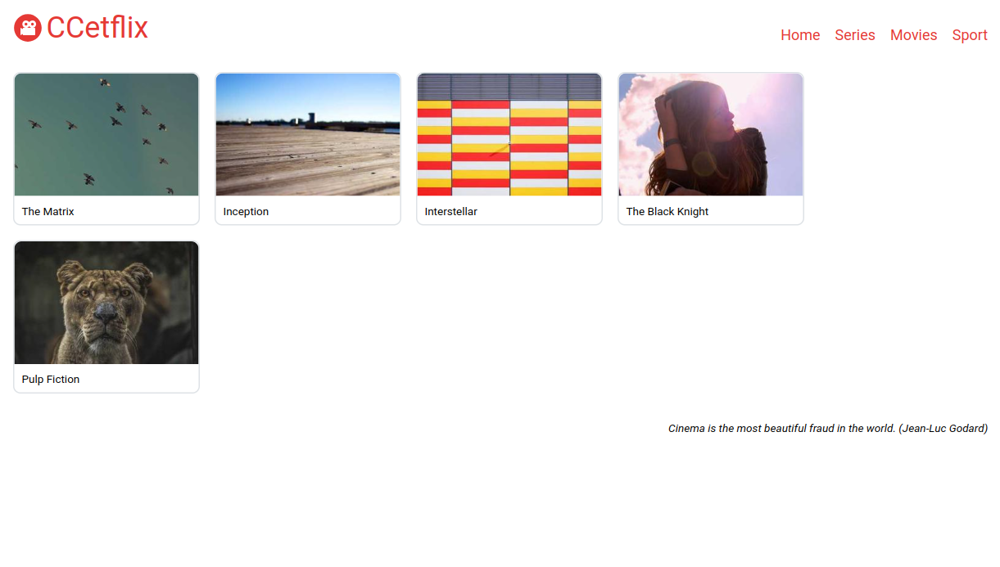
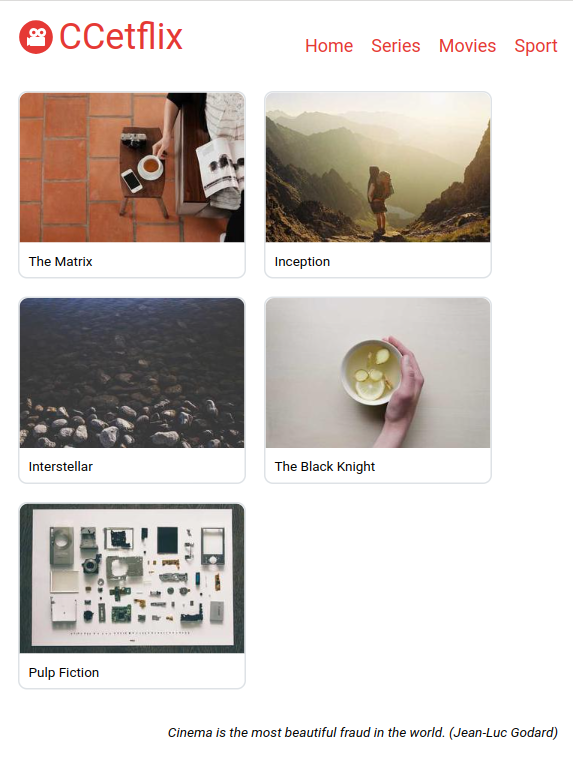
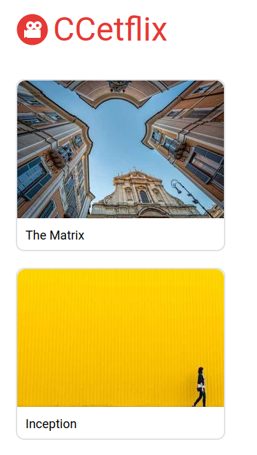
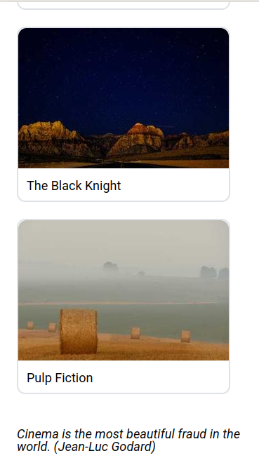

# Sitebuild and Deploy 🌍

## Tasks

1. Implement your solution in the `./src` folder.
2. Use the specification details and the wireframes as a reference.
3. When you are ready, copy or build your src files to your `./dist` folder and publish it using Firebase Hosting or Github Pages. Copy-paste the deployed URL to the `published_url.txt`.

## Specification

### Markup

- The page has three parts, the header, the main content and the footer.
- The header contains a logo (./src/logo.svg) and next to it level 1 header, the title of the page: "CCetflix".
- The header also contains a menu with the following links: "Home", "Series", "Movies", "Sport". The link href's can be simply "#".
- The main part consist of movie tiles. Each movie tile have an image at the top and a title as an h2 heading at the bottom.
  - Create 5 movie tiles: "The Matrix", "Inception", "Interstellar", "The Black Night", "Pulp Fiction".
  - You can use these image URLs (You will get random pictures): 
    - `https://picsum.photos/300/200.jpg?random=1`
    - `https://picsum.photos/300/200.jpg?random=2`
    - `https://picsum.photos/300/200.jpg?random=3`
    - `https://picsum.photos/300/200.jpg?random=4`
    - `https://picsum.photos/300/200.jpg?random=5`
- The footer should contains the following text "Cinema is the most beautiful fraud in the world. (Jean-Luc Godard)".

### Style

- The font size of the root element (html) must be `24px`, the font should be [Roboto](https://fonts.google.com/specimen/Roboto).
- The header has a logo section and a menu section. The logo and a "CCetflix" title should be aligned to the left, the menu items should be aligned to the right. 
- The title and the menu items should be colored `#e53935`.
- The logo must be `2x2rem` large, the title (CCetflix)should be `2rem` large. The space between the logo and the title is `0.25rem`.
- The space between the menu items is `1rem`, they are not underlined.
- The menu should be hidden, if the screen width is less than `620px`.
- The movie list section consist of movie tiles. The tile's image is `300px` wide and `200px` high. Its has a border radius on the top corners: `0.5rem`. The bottom corners are straight.
- Under the image the movie title is displayed. Its font size is `0.75rem`. There is a space `0.5rem` on all side of the title. 
- The border of the tile is `2px` wide, it is colored `#dee2e6` and the line style is solid. The border has a `0.5rem` radius.
- The movie tiles are aligned next to each other. If the screen's width is getting smaller, they are wrapped.
- The footer's quote is placed on the right side. The quote has an italic style and its size is `0.75rem`.

### Wireframes

The site should look the **same** as these screenshots.

#### Desktop

- The tiles are aligned horizontally, wrapped.

#### Tablet

#### Mobile

Top of the page:

Bottom of the page:

- Hence the mobile view is less wider then `620px` the menu
is not visible.

## Hints

- You can use the VS Code Live Server extension (or any static server) to test your implementation.
- You can use the `reset.css` to create a baseline of your CSS implementation.
- You can implement the task in native CSS or using Tailwind.
- If you use Tailwind you need to build your source code, if you use native CSS, you can skip that step.
- Do not take care of the `.gitkeep` files. They are needed to keep their parent directories in git.
