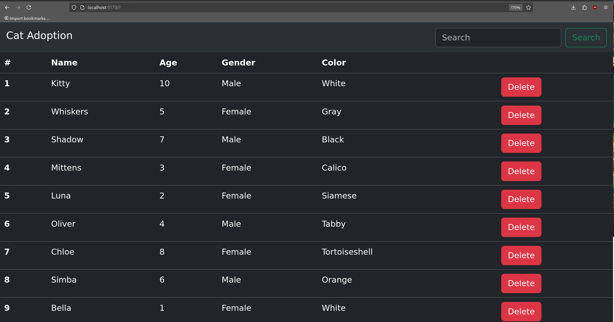

# React ⚛️

## Tasks

### Displaying data in React

1. Set up the project.
2. Use a CSS framework (e.g. Bootstrap/React Bootstrap/MaterialUI) or Tailwind CSS for the implementation.
3. At the top of the page there a navbar (use a CSS framework navbar solution, you can modify it) a `h1` is present in the navbar with the text *Cat Adoption* on the left side of the navbar and on the right side there should be an input field and a button next to each other.
4. Use your CSS framework's table solution to display the cats' data that you receive from the `http://localhost:5173/api/cats` url if you set up the JSON server correctly.
5. In the table the name, age, gender and color should be displayed as well as a red button in the end with the text "Delete".

### Interactions in React

1. Implement a filter feature, if you type anything in the input field in your navbar and press the button next to it then you can filter for the name, age, color and gender of the cat.

    For example:
        - If the user types "Male" than every male cats are being displayed in the table bellow.
        -If the user types "7" than every 7 years old cats are being displayed in the table bellow.
        - If the user types "Toby" than only the cats with the name Toby are being displayed in the table bellow.
        - If the user types "Brown" than only the cats with the color Brown are being displayed in the table bellow.

        If there is a match for either the age, name, gender or the color than the cat is being displayed. You don't have to make the search case insensitive. It's not the scope of the task.

3. If the user leaves the input field in the navbar empty and presses the button than every cat is being displayed again.

2. If the user clicks on the red button at the end of the row inside of the table than the cat is being removed. (You don't have to remove it from the JSON server, it's enough if you remove them from the state.)

Here is a screenshot of the application, using React Bootstrap. It is just an illustrative example, that helps you understand the task. You do not have to follow it.

## Setup the project
 

1. This is a Vite project.
2. Issue `npm install` from **this** folder to install the needed dependencies.
3. Issue `npm run dev` from **this** folder to start the Vite development server.
4. Start the server with the `npm run server` command in a new terminal.
5. Open the [http://localhost:5173](http://localhost:5173) in the browser, it shows the "It Works!" string. 
6. You can test that the server is working by invoking the [http://localhost:5173/api/cats](http://localhost:5173/api/cats) endpoint with your favorite REST Client. (You can use the `requests.http` file if you use the [Rest Client VS Code Extension](https://marketplace.visualstudio.com/items?itemName=humao.rest-client)). You should get 200 OK responses.
7. A proxy is configured on the `vite.config.js` file with an `/api` path prefix to redirect any request starting with `/api` to `http://127.0.0.1:5500`. So you can reach the endpoint from Vite's JS code like this ` fetch("/api/cats")` --> it will be fetched from `http://localhost:5500/cats`.

## Hints

- If you messed up with the database you can copy the `db.original.json` to `db.json` to reset it.
- Do not take care of the `.gitkeep` files. They are needed to keep their parent directories in git.
